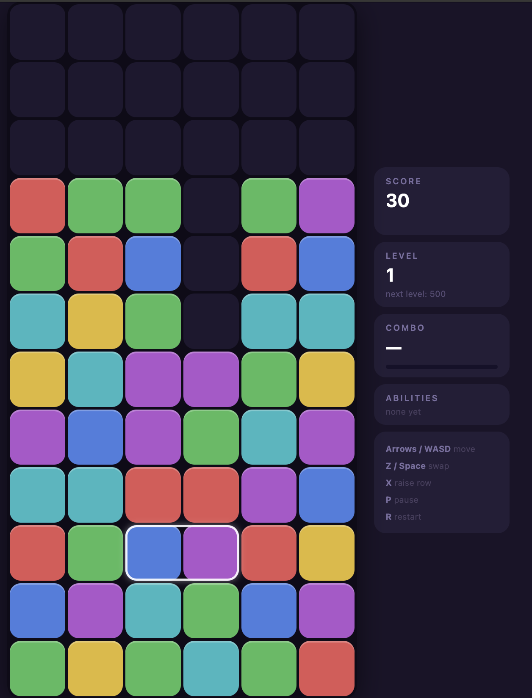

# Tetromania

A Panel de Pon / Tetris Attack clone playable in the terminal or browser. Match colored blocks by swapping adjacent pairs, chain reactions for big scores, and unlock abilities as you level up.

**[Play in browser](https://mimicinnamonster.github.io/tetromania/)**



## Running

```bash
node index.js        # terminal (TTY)
```

Or open the [web version](https://mimicinnamonster.github.io/tetromania/) directly — no install needed. Works on mobile too (touch controls, 4-column grid).

## Controls

**Keyboard:**

| Key | Action |
|-----|--------|
| `←↑→↓` / `WASD` | Move cursor |
| `Z` / `Space` | Swap blocks |
| `X` | Raise stack |
| `P` | Pause |
| `R` | Restart |
| `1` / `2` / `3` | Pick ability |
| `Q` / `Esc` | Quit |

**Mobile (touch):** Tap a cell to move the cursor there. Use the on-screen D-pad, Swap, and Raise buttons.

## How to Play

Blocks rise from the bottom. Move the cursor and swap adjacent pairs to form horizontal or vertical runs of 3 or more matching colors. Matched blocks clear, and any blocks left floating fall — setting off chains. Chains and combos multiply your score.

The game ends when a block reaches the top row as a new row rises.

## Abilities

Every 500 points earned unlocks an ability pick. Each ability has 3 levels and can be picked multiple times to upgrade. Abilities include:

- **Painter** — seeds new rows with matching pairs for easy combos
- **Bomb** — manual swaps blast a 2×2–4×4 area at the cursor
- **Ripple** — same-color neighbors spread into a clear
- **Magnetism** — same-color swaps pull matching blocks toward the cursor
- **Overclock** — chains of 3× or more multiply your score for 8 seconds
- **Panic Shield** — auto-clears the top row when the stack gets too high
- ...and 14 more

## Build

```bash
node build.js web    # → dist/web.html  (single-file browser build)
node build.js tty    # → dist/tetromania.js  (TTY bundle)
```

No dependencies — pure Node.js built-ins only.
